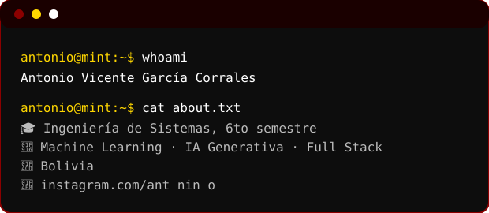
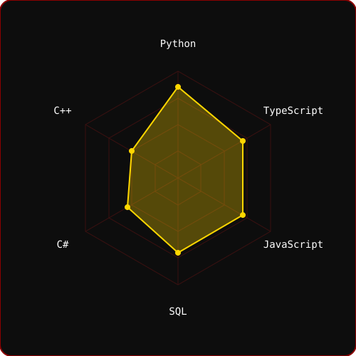

[;Machine+Learning+%7C+IA+Generativa+%7C+Full+Stack;Python+%7C+FastAPI+%7C+React+%7C+TypeScript+%7C+SQL;Remoto+%2F+H%C3%ADbrido+%7C+Pr%C3%A1cticas+%2F+Junior)](https://github.com/ANTONIO30-09)

---

## `$ whoami`

<table>
  <tr>
    <td align="center" width="240">
      
    </td>
    <td>
      
    </td>
  </tr>
</table>

---

## `$ cat tech-stack.yaml`

| `antonio@mint:~$ cat tech-stack.yaml` | |
| :--- | :--- |
| `├─ ✦ lenguajes:`      `Python · TypeScript · JavaScript · C# · C++` | `├─ ◈ ml_ia:`      `PyTorch · TensorFlow · NumPy · Pandas` |
| `├─ ⚙ backend_frontend:`      `FastAPI · React · Node.js · HTML · CSS` | `├─ ▣ bases_de_datos:`      `PostgreSQL · MySQL · SQL` |
| `╰─ ⌁ herramientas:`      `Linux · Bash · Git · GitHub · Docker · VS Code` | `status: learning  ·  environment: always-on` |

---

## `$ ./skills --radar`

`signals: skill_radar · language_radar · status: healthy`

---

## `$ connect --socials`

Hecho con 💛 y mucho café desde Bolivia · @ANTONIO30-09

